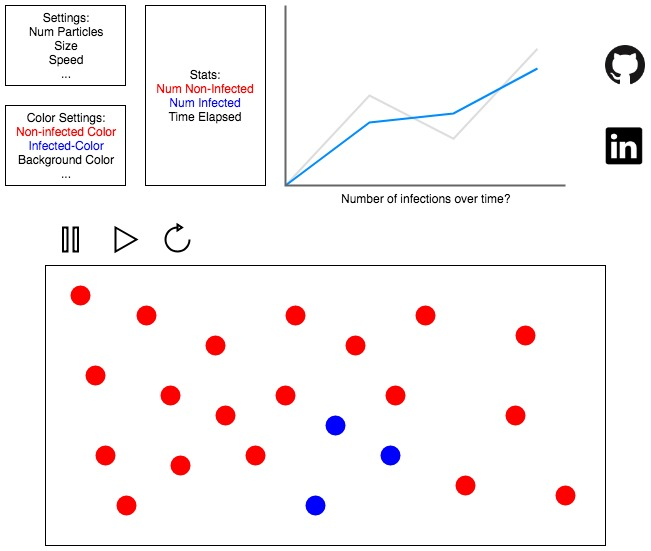

## (JS Project Title)
### Background and Overview
(WORKING TITLE) is a simulation of moving particles colliding in a confined space. A certain number of particles are "infected". Each time a collision occurs with an "infected" particle, that particle also becomes infected, thus spreading the infection at an accelerated rate.

The total number of infected and non-infected particles will be displayed, as well as a timer that will stop when all particles become infected.

Users are able to define the size of the space, the total number of particles, the starting number of infected particles, the size of the particles, and the speed of the particles.

Users can also choose colors for the particles and the background.

### Functionality & MVP

In (WORKING TITLE), users will be able to:
- [ ] Choose the number of particles and tweak various properties of the particles, such as size, speed, and color
- [ ] Define the space of the simulation
- [ ] See live stats of the simulation
- [ ] Start, pause, and restart the simulation

### Wireframes

The app will consist of a single screen with the settings, playback controls, and stats on top. The upper right will have icons linking to my GitHub and LinkedIn profile.

The rest of the screen will house the simulation. This choice was made because users will be able to change the size of the simulation canvas through the settings.

### Architectures and Technologies

This project will be implemented with the following technologies:

- Vanilla JavaScript for overall structure and game logic,
- `HTML5 Canvas` for DOM manipulation and rendering,
- `Paper.js` for handling particle creation and rendering
- Webpack to bundle and serve up the various scripts

### Implementation Timeline

**Over the weekend:**
- [x] Read up and do the tutorials on paper.js
- [x] Play around and experiment with paper.js to get a feel for how it works

**Day 1:** Setup `webpack` and `webpack.config.js`. Create basic entry file and skeleton of classes that I may need. Goals for the day:
- [ ] Get `webpack` up and running
- [ ] Determine what files I'll need (TA review please), and write basic logic of each.

**Day 2:** Create the basic simulation. Particles should spawn in random locations within the canvas, move in random directions, bounce off walls, and infect other particles. Goals for the day:
- [ ] Particle spawning within the canvas in random locations
- [ ] Particle movement in a random direction
- [ ] Particles bouncing off walls
- [ ] Particles infecting other particles

**Day 3:** Settings and stats.
Goals for the day:
- [ ] Allow user to the change the settings of the simulation and be able to restart with their settings in place
- [ ] Show count of non-infected and infected particles, along with the total time it took to infect all particles
- [ ] Show live graph of rate of infection

**Day 4:** Touching up. Adding GitHub and LinkedIn icons. Styling. Any user experience enhancements. Goals for the day:
- [ ] Add links to GitHub and LinkedIn
- [ ] Any styling improvements
- [ ] Any user experience changes (for example, changing the settings to a modal or adding an about section)

### Bonus Features
- [ ] Users can spawn particles with their mouse, either by clicking or dragging
- [ ] Allow a setting that changes how infection occurs (instantaneously with contact vs over time depending on distance)
- [ ] Optimizations to handle a greater number of particles
- [ ] Give AI to the particles that will determines how it moves
