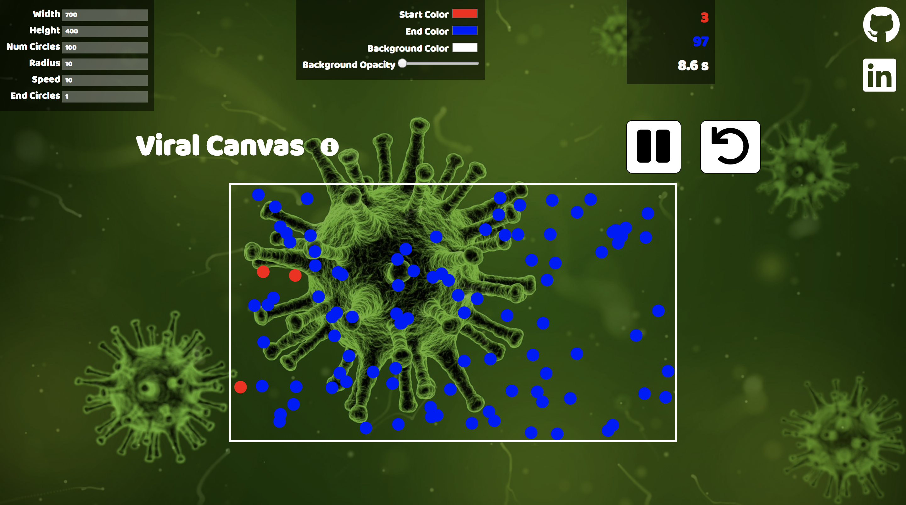

## Viral Canvas
[Live Site](https://stevielum1.github.io/viral_canvas/)

### Background and Overview
`Viral Canvas` is a sandbox simulation of moving particles colliding in a confined space. A certain number of particles are "infected". Each time a collision occurs with an "infected" particle, that particle also becomes infected, thus spreading the infection at an accelerated rate.

### Architectures and Technologies

This project is implemented with the following technologies:

- Vanilla JavaScript for overall structure and game logic,
- `HTML5 Canvas` for DOM manipulation and rendering,
- `Paper.js` for handling particle creation and rendering,
- Webpack to bundle and serve up the various scripts



### Code Highlights
The code below is used to create the initial grid system, a hash of 1D arrays in my case. The coordinate of each cell in the grid is the key and the value is an array of particles whose position is inside that cell. Run in the initialize method, every time the user restarts the simulation, the grid is dynamically sized to fit, on average, 1 particle at a time. The cell width and height are `(2 * radius)` or the diameter of the particles.
```javascript
// js/game_view.js
createCells() {
  this.cells = {};
  this.cellWidth = (2.0 * this.radius);
  this.cellHeight = (2.0 * this.radius);

  for(let i = 0; i < this.width / this.cellWidth; i++) {
    for(let j = 0; j < this.height / this.cellHeight; j++) {
      const cell = [];
      project.activeLayer.children.forEach(circle => {
        if (i * this.cellWidth < circle.position.x &&
            circle.position.x <= (i+1) * this.cellWidth &&
            j * this.cellHeight < circle.position.y &&
            circle.position.y <= (j+1) * this.cellHeight) {
              cell.push(circle);
            }
      });
      this.cells[`${i}-${j}`] = cell;
    }
  }
}
```
The advantages of using a grid system is that we only need to check the current and adjacent cells for collisions, instead of having to check every single particle with every other particle.
```javascript
// js/game_view.js

//we pass in the current particle, called circle, and its x and y cell coordinates
checkSurroundingCollisions(circle, x, y) {
  //check for null in case the current cell is at the border of our grid
  const upperLeft = this.cells[`${x-1}-${y-1}`] || null;
  const up = this.cells[`${x}-${y-1}`] || null;
  const upperRight = this.cells[`${x+1}-${y-1}`] || null;

  const left = this.cells[`${x-1}-${y}`] || null;
  const mid = this.cells[`${x}-${y}`] || null;
  const right = this.cells[`${x+1}-${y}`] || null;

  const lowerLeft = this.cells[`${x-1}-${y+1}`] || null;
  const lower = this.cells[`${x}-${y+1}`] || null;
  const lowerRight = this.cells[`${x+1}-${y+1}`] || null;

  if (upperLeft) {
    upperLeft.forEach(other => this.checkCollision(circle, other));
  }
  //repeat for all 9 cells
}
```
Below is an example. Imagine that the blue circle is our current particle. We only need to check its cell and the 8 adjacent cells for collisions. We are guaranteed that collisions will only occur within these 9 cells because we dynamically sized our cells to be the size of our particles.


The tradeoff of having a grid system like this is that we will constantly need to move the circles to the correct cell when the circles move from one cell to another.